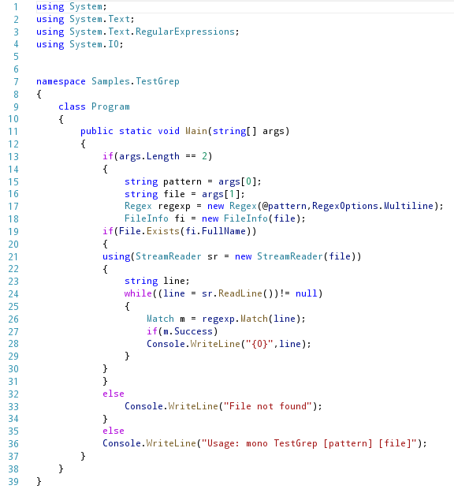
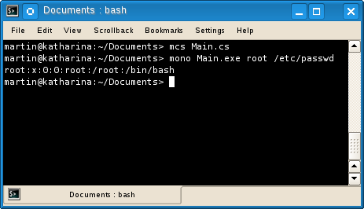
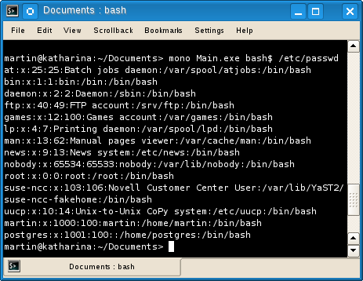
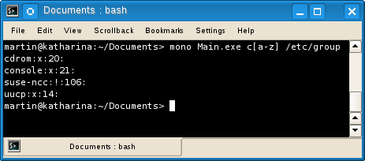

# Regular Expressions con C#

Las expresiones regulares (regular expressions) han sido utilizadas con éxito desde hace tiempo como una solución avanzada mucho más compleja y eficiente para el procesamiento y la validación de texto en herramientas como grep, sed, AWK, bash y en lenguajes de programación del tipo scripting como Perl, Python y PHP.

Una expresión regular (regular expression o regexp) es un patrón de cadenas de caracteres formado por una combinación de caracteres especiales llamados metacaracteres o cuantificadores y de caracteres alfanuméricos llamados literales, este patrón representa un lenguaje regular o un conjunto regular de cadenas para tres operaciones básicas: adyacencia, repetición y alteración.

En el sitio http://www.regular-expressions.info/ se da una mayor referencia acerca de los cuantificadores y su significado.

Existen dos implementaciones de expresiones regulares POSIX y PERL, en el caso de .NET el motor de expresiones regulares utiliza la implementación compatible con Perl 5.
Las expresiones regulares en .NET se encuentran integradas como clases dentro del ensamblado System.Text.RegularExpressions estas clases utilizan un motor implementado como un autómata finito no determinístico (NFA) similar al que emplean Perl, Python y Emacs con algunas características propias de .NET.

Para ejemplificar el uso de expresiones regulares en C#, mostraremos un programa sencillo que tenga una funcionalidad similar al comando grep o egrep, como sabemos este comando en su funcionamiento básico recibe como argumentos una expresión regular y uno o varios archivos en donde buscar e imprime las líneas que coincidan con esa expresión regular.

Fig 1. El código fuente del programa

Al ejecutar el programa podemos observar el resultado como se muestra en las siguientes imágenes probando con diferentes patrones con los archivos etc/password y /etc/group respectivamente.

Fig 2. Una primera prueba con el archivo /etc/password

Fig 3. Una segunda prueba con el archivo /etc/password

Fig 4. Probando con el archivo /etc/group

